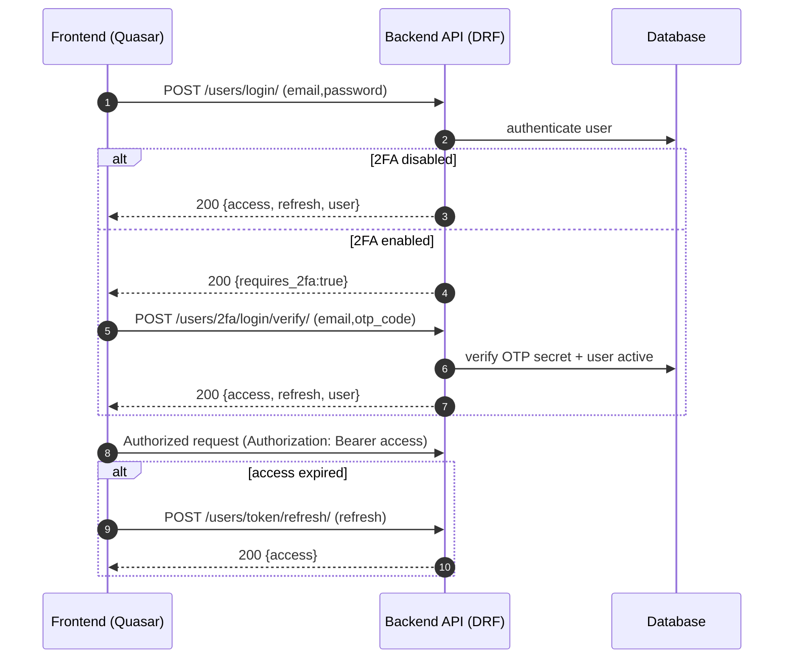
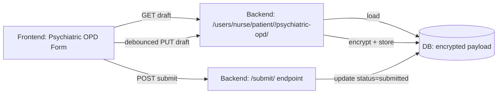
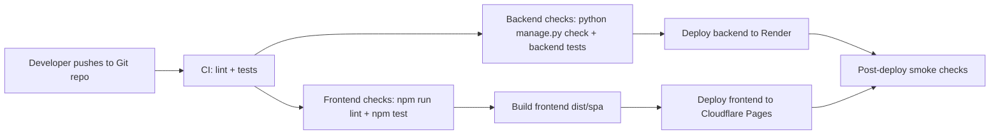

## Integration, Security, and DevOps Design (MediSync)

### A. Integration Design

#### A.1 API Structure (Endpoints)

**Base path**
- Backend base paths (no `/api/` prefix):
- Route groups:
  - `/users/` → user authentication, profile, verification, 2FA, and nurse/doctor patient form APIs
  - `/operations/` → queueing, appointments, messaging, notifications, archives, monitoring, and secure transmission APIs
  - `/analytics/` → analytics, telemetry, uptime endpoints
  - `/admin/` → admin authentication and verification/hospital management endpoints
  - `/django-admin/` → Django admin UI

**Endpoint inventory**
- Full endpoint listing is documented in `docs/API_IMPLEMENTATION.md`.

#### A.2 Middleware Design

**HTTP middleware layer (Django)**
- Security middleware: baseline security headers and request protections
- Session middleware: session support (also used by DRF SessionAuthentication if enabled)
- CORS middleware: cross-origin request handling for SPA/mobile clients
- Common middleware: common request/response normalizations
- CSRF middleware: CSRF protection for session-based auth paths (JWT clients typically rely on Authorization header)
- Authentication middleware: populates `request.user`
- Messages/clickjacking: standard Django middleware

**API layer (Django REST Framework)**
- Authentication chain (configured in settings):
  - JWT (primary for SPA/mobile)
  - Session auth (optional)
  - Token auth (optional)
- Default permission class: authenticated by default; public endpoints opt-in with `AllowAny`
- Validation layer: DRF serializers validate payload structure and field formats for many endpoints

**Async/Integration layer**
- Redis:
  - Cache backend
  - Celery broker/result backend
  - Channels layer backing store
- Celery:
  - Scheduled/background processing (queue auto-close, notification retry, queue stats updates)
- Channels (WebSockets):
  - Real-time events for queues, messaging, and medication-related streams

#### A.3 Data Flow Diagrams

##### A.3.1 Authentication (JWT + refresh + optional 2FA)



##### A.3.2 Psychiatric OPD Draft Autosave (Nurse workflow)



##### A.3.3 Queue + Real-time Updates (WebSockets)

```mermaid
flowchart TD
  P[Patient action: join queue] --> API[Backend: /operations/queue/join/]
  API --> DB[(DB: QueueManagement/QueueStatus)]
  API --> CACHE[(Redis cache)]
  API --> CH[Channels layer (Redis)]
  CH --> WS1[WebSocket group: ws/queue/<department>/]
  WS1 --> NFE[Nurse/Doctor dashboards update in real time]
```

### B. Security Design

#### B.1 Authentication & Authorization

**Authentication**
- Primary: JWT (SimpleJWT) for SPA/mobile clients.
- Secondary/optional: SessionAuthentication and TokenAuthentication are enabled in DRF settings for compatibility.
- 2FA: supported for users who enable it; login becomes a two-step flow (credentials → OTP verification → tokens).

**Authorization**
- Default API access: authenticated-only (DRF default permission).
- Public endpoints explicitly opt in with `AllowAny` (e.g., register/login, some lookups).
- Role-based access control (RBAC):
  - View-level role checks (e.g., nurse-only endpoints)
  - Some workflows additionally require verification status (e.g., nurse verification gating)

#### B.2 Data Protection Measures

**Transport protection**
- Intended deployment behind HTTPS (Render + Cloudflare) so all API traffic is encrypted in transit.
- WebSocket traffic uses WSS in production under HTTPS termination.

**At-rest protection**
- Psychiatric OPD draft payloads are encrypted at rest in the database (encrypted payload field).

**Access logging / auditing (where present)**
- Archive access logging exists for medical record archive workflows.
- Secure transmission endpoints maintain audit-related models (transmission audit, purge audit logs).

**Input validation**
- DRF serializers validate many inbound payloads (registration, profile updates, nurse forms).
- File upload constraints include size limits and allowed extensions.

**Secure configuration**
- Secrets are environment-driven (deployment-friendly) rather than committed into source.
- CORS settings support explicit allow-listing for production deployments.

### C. DevOps Pipeline

#### C.1 CI/CD Workflow Diagram (Render + Cloudflare Pages)



#### C.2 Tools Used

**Source control**
- Git (repository-based version control)

**Backend**
- Django + Django REST Framework
- SimpleJWT (JWT auth)
- Redis (cache + channels + broker)
- Celery (background jobs)
- Channels/Daphne (ASGI/WebSockets)

**Frontend**
- Quasar (Vue) + Vite
- Axios (API calls)

**Deployment targets**
- Render (backend web service)
- Cloudflare Pages (frontend static hosting)

**Monitoring/logging**
- Python logging (server-side logs visible in Render logs)
- Client log ingestion endpoint (`/operations/client-log/`)
- Analytics uptime/telemetry endpoints (`/analytics/uptime/*`, `/analytics/events/*`)
